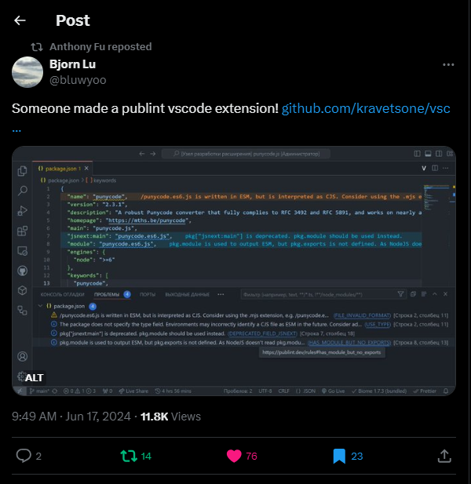

# Привет, я [Kravets](https://github.com/kravetsone/) 👋

-   Спикер [Я 💛 Фронтенд 2024](https://www.youtube.com/watch?v=XD2jA53CXQw), с докладом про Elysia + Bun и о остальных бекенд фреймворках.

## ✨ Навыки

#### 🖌️ Фронтенд

### ⚙️ Бекенд

### 🛠 Инструменты

## 👉 Мои проекты

#### 1. [[`GramIO`](https://github.com/gramiojs)] - Telegram Bot API фреймворк для создания ботов с удобством!

-   [[`types`](https://github.com/gramiojs/types)] - Авто-обновляемая и кодогенерируемая библиотека с типами [Telegram Bot API](https://core.telegram.org/bots/api) с помощью Github Actions

-   [[`keyboards`](https://github.com/gramiojs/keyboards)] - Фреймворк-агностик библиотека для создания клавиатур телеграм ботам с многими классными возможностями!

-   [[`documentation`](https://gramio.netlify.app/)] - Документация на [VitePress](https://vitepress.dev/) с авто-деплоем на [Netlify](https://www.netlify.com/)

-   [[`media-cache`](https://github.com/gramiojs/prompt)] - Плагин, который предотвращает лишние загрузки файлов сохраняя их `file_id` в [GramIO](https://github.com/gramiojs)

-   [[`create-gramio`](https://github.com/gramiojs/create-gramio)] - Скаффолдер, который позволяет развернуть проект с [GramIO](https://github.com/gramiojs) и окружением очень легко

-   [[`auto-retry`](https://github.com/gramiojs/prompt)] - Плагин, который повторяет запросы получившие `retry_after` параметр в [GramIO](https://github.com/gramiojs)

-   [[`format`](https://github.com/gramiojs/format)] - Библиотека для форматирования текста

-   [[`files`](https://github.com/gramiojs/files)] - Библиотека для удобной работой с загрузкой файлов для Telegram Bot API (работает под капотом GramIO)

-   [[`autoload`](https://github.com/gramiojs/autoload)] - Плагин для автозагрузки команд и т.д. из файлов в [GramIO](https://github.com/gramiojs)

-   [[`session`](https://github.com/gramiojs/session)] - Плагин для сессий в [GramIO](https://github.com/gramiojs)

-   [[`prompt`](https://github.com/gramiojs/prompt)] - Плагин реализующий "Вопрос-Ответ" в [GramIO](https://github.com/gramiojs)

-   [[`i18n`](https://github.com/gramiojs/i18n)] - Плагин, который позволяет удобно работать с локализацией

-   [[`media-group`](https://github.com/gramiojs/i18n)] - Плагин, который позволяет собрать медиа группу благодаря debounce

#### 2. [[`t-kassa-api`](https://github.com/kravetsone/t-kassa-api)] - Библиотека для взаимодействия с [API Т-Кассы](https://www.tbank.ru/kassa/dev/payments/index.html). Генерируется из OpenAPI спецификации и имеет удобную работу с webhook и умными фильтрами.

#### 3. [[`vscode-publint`](https://github.com/kravetsone/vscode-publint)] - Расширение для [VS Code](https://code.visualstudio.com/), которое позволяет линтить `package.json`, добавляя интеграцию с [publint.dev](https://publint.dev) ([о расширении даже рассказали в Twitter](https://x.com/bluwyoo/status/1802594411647537254))

#### 4. [[`elysia-autoload`](https://github.com/kravetsone/elysia-autoload)] - Плагин для [Elysia](https://elysiajs.com), который загружает все endpoints в папке и генерирует типы для [Eden](https://elysiajs.com/eden/overview.html)

#### 5. [[`create-elysiajs`](https://github.com/kravetsone/create-elysiajs)] - Модуль, который позволяет развернуть проект с [ElysiaJS](https://elysiajs.com) фреймворком и настроить его окружение простой командой `bun create elysiajs`. Biome, ESLint, Prisma, Drizzle, Husky и выбор плагинов. Авто-обновление зависимостей (включая те которые используются в генерации шаблона) с помощью Renovate

#### 6. [[`elysia-oauth2`](https://github.com/kravetsone/elysia-oauth2)] - Плагин для [Elysia](https://elysiajs.com), который реализует удобную работу с авторизацией по протоколу [OAuth 2.0](https://en.wikipedia.org/wiki/OAuth), предоставляя **53+** адаптера под различные сервисы

#### 7. [[`elysia-react-router`](https://github.com/kravetsone/elysia-react-router)] - Плагин для [Elysia](https://elysiajs.com), который помогает интегрировать [React Router](https://reactrouter.com/) в [Elysia](https://elysiajs.com)

#### 8. [[`jobify`](https://github.com/kravetsone/jobify)] - Удобная обёртка над [BullMQ](https://bullmq.io/)

#### 9. [[`webhook-openapi`](https://github.com/kravetsone/webhook-openapi)] - Библиотека нацеленная на помощь в реализации Webhook сервера с генерацией OpenAPI, плагинами и так далее

#### 10. [[`enkaNetwork`](https://github.com/kravetsone/enkaNetwork)] - TypeScript модуль, который позволяет удобно работать с [enka.network](https://enka.network/) добавляя локализацию и работу с асетами (например, авто-обновление)

#### 11. [[`fluent2ts`](https://github.com/kravetsone/fluent2ts)] - CLI утилита, которая позволяет генерировать типы для [Fluent](https://projectfluent.org/) (`.ftl`) файлов локализации

#### 12. [[`slidev-addon-qrcode`](https://github.com/kravetsone/slidev-addon-qrcode)] - Аддон для [slidev](https://sli.dev/), который предоставляет QRCode компонент (обёртка над [qr-code-styling](https://github.com/kozakdenys/qr-code-styling))

#### 13. [[`aigram-monorepo`](https://github.com/kravetsone/aigram-monorepo)] - MVP мессенджера в монорепе с e2e type-safety. ([Svelte](https://svelte.dev/) + [Effector](https://effector.dev/) и [ElysiaJS](https://elysiajs.com/) + [Drizzle](https://orm.drizzle.team/))

#### 14. [[`Code Syntax Highlighter`](https://github.com/kravetsone/Code-Syntax-Highlighter)] - Плагин/Виджет для [Figma](https://www.figma.com/) который отрендерит текст с подсветкой синтаксиса. Поддерживаются многие языки и множество тем благодаря [Shiki](https://shiki.style/guide/).

#### 15. [[`PAYOK`](https://github.com/kravetsone/payok)] - TypeScript модуль, который позволяет принимать платежи агрегатора [payok.io](https://payok.io/)

#### 16. [[`rustore_notify`](https://github.com/kravetsone/rustore_notify)] - Телеграм бот написанный на [Rust](https://www.rust-lang.org/) с использованием [Teloxide](https://github.com/teloxide/teloxide) (магазин приложений **RuSt**ore в виде бота)

### Проекты с [хакатонов](#-хакатоны-и-другие-мероприятия)

#### 1. [[`Мемология`](https://vk.com/app51712852)] - VK MINI APPS, который не одержал победы в VK FRESH CODE 2023

-   [Бекенд](https://github.com/kravetsone/memology-backend). Fastify, TypeScript, Prisma, Protobuf over HTTP
-   [Фронтенд](https://github.com/localhostov2/memology). React, TypeScript, Effector, Protobuf

#### 2. [[`webauthn-store`](https://github.com/noname-to/nuclear-linker)] - приложение, которое [эмулирует флешку с ключом безопасности](https://github.com/bulwarkid/virtual-fido) и сохраняет его на сервере для кросс-девайс авторизации по протоколу [webauthn](https://developer.mozilla.org/en-US/docs/Web/API/Web_Authentication_API)

-   [Бекенд](https://github.com/kravetsone/webauthn-store-backend). Elysia, TypeScript, Drizzle
-   [Приложение](https://github.com/kravetsone/webauthn-store-app). [Wails](https://wails.io/), GoLang, Svelte, TypeScript, Effector, Protobuf, [Virtual FIDO](https://github.com/bulwarkid/virtual-fido)

#### 3. [[`driveIT-backend`](https://github.com/kravetsone/driveIT-backend)] - Бекенд для веб-платформы ЦОДД, который публикует телеметрию судов и отдаёт различную информацию (REST, WEBSOCKET, PROTOBUF)

#### 4. [[`rosatom-backend`](https://github.com/kravetsone/rosatom-backend)] - Бекенд для управления сущностями (CRUD с импортом и экспортом) и формированием телеметрии судов

#### 5. [[`pro.fipro`](https://github.com/kravetsone/pro.firpo)] - Репозиторий с бекендом, который разрабатывался в качестве подготовки к чемпионату (с ограниченным стеком и без интернета). Стек - Express & TypeORM и фронтендом для этого бекенда на React

## 📖 Моя статистика в GitHub ()

## ⌛ Моя статистика в WakaTime ()

## ❓ Как со мной связаться?

## 🎧 Моя недавно прослушанная музыка

